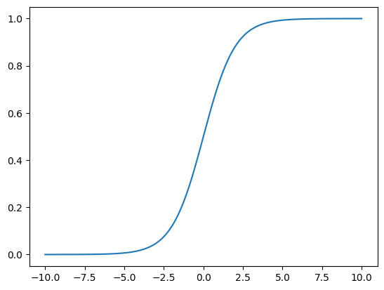

# [clf]Logistic Regression
## How it works
* step1(regression step)similar to Linear Regression, we find probability as output for certain x:$\widehat{p} = f(x)$ ( similar to$\widehat{y} = f(x)$ in Lin_reg)
  * only used in binary classification problem, output probabilities rather than just class labels
* step2(classifier step) decide O|1 based on probability value 
  *$\hat{y} = 
    \begin{cases} 
    1, & \hat{p} \geq 0.5 \\ 
    0, & \hat{p} < 0.5 
    \end{cases}$
  - $
  y^* = \arg\max_y (P(y|x))
  $
  Logistic regression classifies based on the highest probability for each class.
    * y = 0 or 1 depends on max(P(y = 1|x ), P(y = 0|x))
* [click for interactive visualization](https://mlu-explain.github.io/logistic-regression/)
* [click for code implementation explaination](https://bio304-class.github.io/bio304-fall2017/logistic-regression.html)

## Math
### [find probability] P(y|X) = $\sigma()$ 
${P(y|x,\theta)} = \sigma(\theta^T \cdot x) = \frac{1}{1 + e^{-\theta^T \cdot x}}$
* $x = (x_1,x_2,...,x_k)$, 
  
* $\sigma(t) = \frac{1}{1 + e^{-t}}$ 
    * 
    * probability's range is [0, 1]
    * when t > 0, p>0.5
    * when t < 0, p<0.5
### (loss) function
$\text{cost} = -y\log(\hat{p})-(1-y)\log(1 - \hat{p})$
* based on $\hat{y} = 
    \begin{cases} 
    1, & \hat{p} \geq 0.5 \\ 
    0, & \hat{p} < 0.5 
    \end{cases}$ 
    * when y = 1, when p is smaller, the cost is larger
    * when y = 0, when p is larger, the cost is larger
* so when y = 1, when p is smaller 
$\text{cost} = \begin{cases} - \log(\hat{p}) & \text{if } y = 1 \\ - \log(1 - \hat{p}) & \text{if } y = 0 \end{cases}$
* so $\text{cost} = -y\log(\hat{p})-(1-y)\log(1 - \hat{p})$
* and y have m samples , we get average loss: 
  
     $J(\theta) = -\frac{1}{m} \sum_{i=1}^m \left( y^{(i)} \log(\hat{p}^{(i)}) + (1 - y^{(i)}) \log(1 - \hat{p}^{(i)}) \right)$

## strength 
* Only **binary and millticlass classification**
  * but multi-classification question can be transformed to binary classfication questions and then use logisticReg method to solve

- **effective in high demension**: 
  
   $P(y=1|x) = w^T x + b \approx \log \frac{P(y=1|x)}{P(y=0|x)}$

  Assumes a linear relationship between features and output. Uses a linear combination of features to estimate log-odds(log fraction above)
  This assumption allow it to perform great in most linear binary classficiation task, especially in the high demension datasets(img,text)
- **fast prediction**: since only need to calculate $\sigma()$
## Limitation
- **Relies on good input features**: Performance depends on quality of features; may struggle with non-linearly separable data. 

