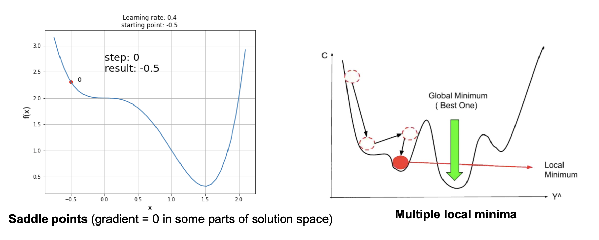

Optimization and Stochastic Gradient Descent
# what is gradient descent
Gradient descent is a fundamental optimization algorithm:
* Iteratively updates parameters by moving in the **negative gradient direction** to minimize the loss function.
* Formula:  $x = x - \eta \cdot \nabla f(x)$ , where $\eta$ex is the learning rate.
  * $x$: model parameter
  * $\nabla f(x)$: Gradient of loss function with respect to the parameter
```
gradient_descent(f'(x), x0 , lr, niter)
    x = x0
    for t in range(niter):
        x = x - lr*f'(x)
    return x
```
* every iteration, model parameter will be updated as
* $\mathbf{w}_{t+1} = \mathbf{w}_t - \eta \cdot \nabla \mathcal{L}(\mathbf{w}_t)$
# how's it related to SVM
Gradient Descent is directly related to Support Vector Machines (SVM) because it provides a way to optimize the parameters (weight vector \mathbf{w} and bias b) in the primal form of SVM. Here’s how they are connected
# challenge of classic gradient descent algorithm
1. gradient descent may get stuck in a local minimum or a saddle point (where the gradient is zero).
2. Learning rate = step size that is multiplied by gradient direction/magnitude
   1. – Large rate allows big movements toward optimum but might over-step, or overshooting the optimal point
   2. Small rate is less likely to over-step but could take longe , may get stuck in local minima
   3. solution1: Learning schedule: change learning rate over time
      - Constant
      - Exponential decay, e.g. lr = lr * 0.95
      - Linear, e.g. lr = lr0 *(1 – iter / max_iter)
   4. solution2:  adaptive methods like Adam or RMSprop
# SGD
instead of using the entire dataset, SGD uses one data sample (or a mini-batch) per update.