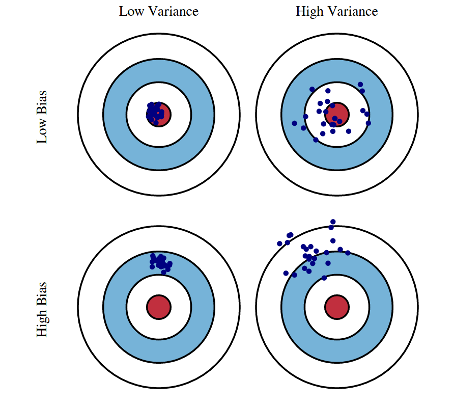
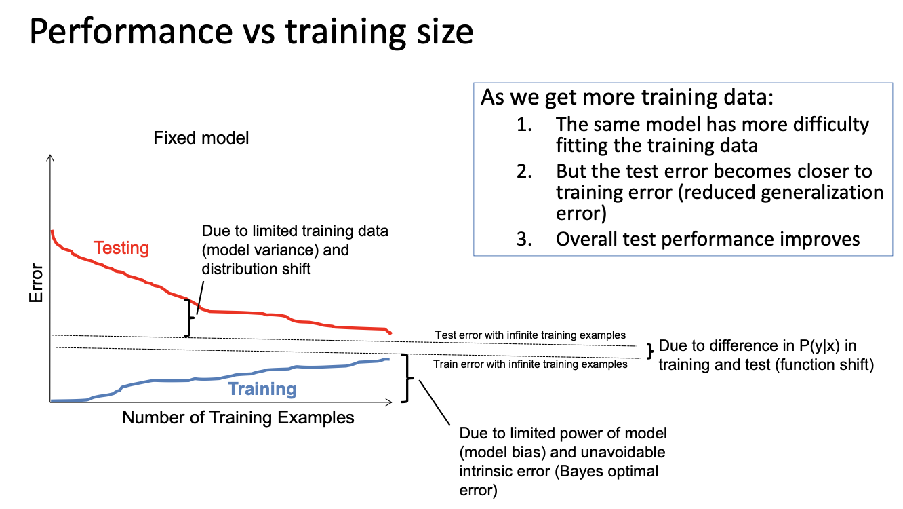

# bias-variance trade off 
For both regression and classification, error can be broken down as:
$
\text{Error} = \text{Variance} + \text{Bias}^2 + \text{Noise}
$

Variance(离散): due to limited data
Different training samples will give different models that vary in predictions for the same test sample

“Noise”: irreducible error due to data/problem

Bias(偏见): error when optimal model is learned from infinite data

High variance
- test error is much higher than training error
  
High bias
- training error is high
  
as complexity increased
- training error will decrease
- test error will 
  - increase if overfitting
  - decrease if underfitting
**generalized model**
model get generalized well means it have low bias and low variance, hit the optimum model complexity 

