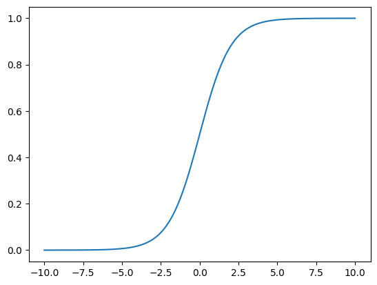

# Logistic Regression
## what it is
* step1(regression step)similar to Linear Regression, we find probability as output for certain x: $\widehat{p} = f(x)$ ( similar to $\widehat{y} = f(x)$ in Lin_reg)
* step2(classifier step)
  * $\hat{y} = 
    \begin{cases} 
    1, & \hat{p} \geq 0.5 \\ 
    0, & \hat{p} < 0.5 
    \end{cases}$
* above all, logistic regression usually can only be used for binary classification
  * but multi-classification question can be transformed to binary classfication questions and then use logisticReg method to solve

## how it works
### [find probability] sigmoid function $\sigma()$ 
  * $\hat{p} = \sigma(\theta^T \cdot x_b) = \frac{1}{1 + e^{-\theta^T \cdot x_b}}$
  * $\sigma(t) = \frac{1}{1 + e^{-t}}$ 
    * 
    * probability's domain is [0, 1]
    * when t > 0, p>0.5
    * when t < 0, p<0.5
### cost function
* based on $\hat{y} = 
    \begin{cases} 
    1, & \hat{p} \geq 0.5 \\ 
    0, & \hat{p} < 0.5 
    \end{cases}$ 
    * when y = 1, when p is smaller, the cost is larger
    * when y = 0, when p is larger, the cost is larger
* so when y = 1, when p is smaller 
$\text{cost} = \begin{cases} - \log(\hat{p}) & \text{if } y = 1 \\ - \log(1 - \hat{p}) & \text{if } y = 0 \end{cases}$
* so $\text{cost} = -y\log(\hat{p})-(1-y)\log(1 - \hat{p})$
* and y have m samples : $J(\theta) = -\frac{1}{m} \sum_{i=1}^m \left( y^{(i)} \log(\hat{p}^{(i)}) + (1 - y^{(i)}) \log(1 - \hat{p}^{(i)}) \right)$
